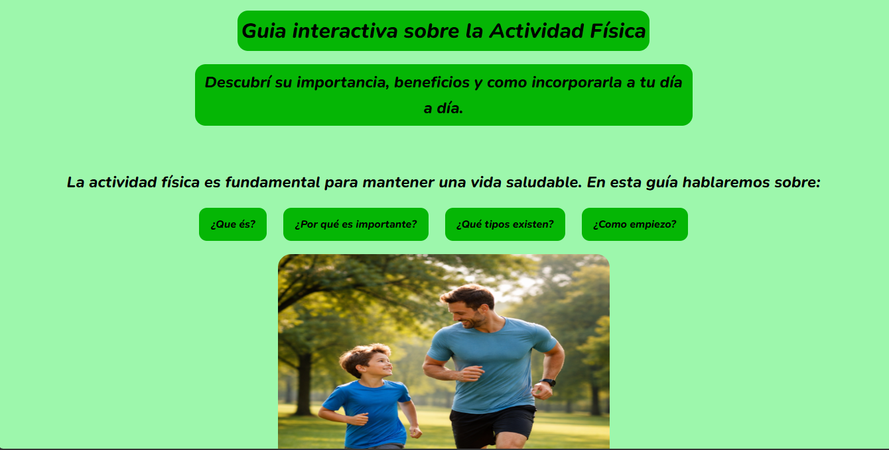
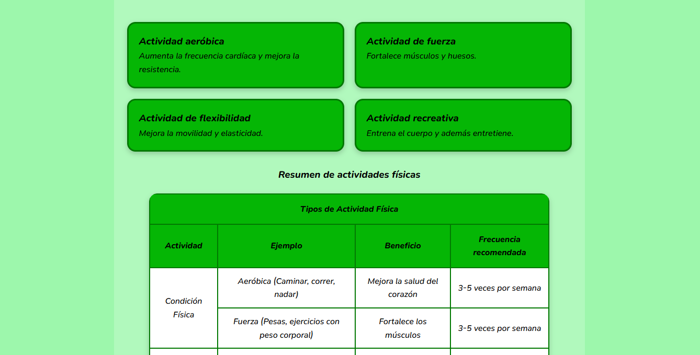
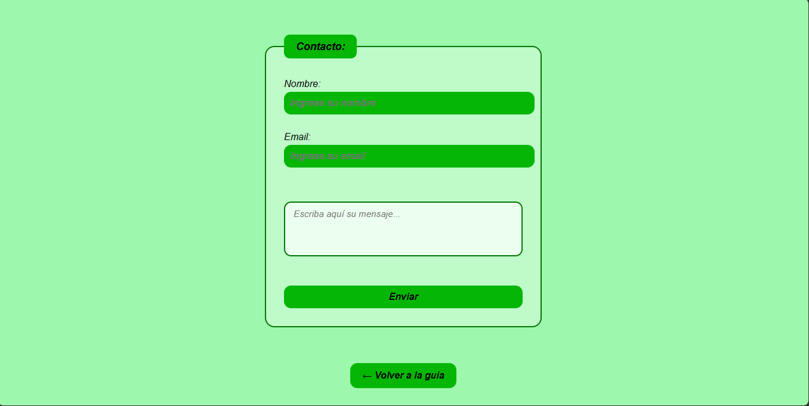

# Guía interactiva sobre la Actividad Física

## Descripción
Esta página web interactiva trata sobre la importancia de la actividad física en la vida cotidiana, sus beneficios, los distintos tipos de ejercicios y recomendaciones para comenzar de manera saludable.

## Contenido
- ¿Qué es la actividad física?
- Importancia de la actividad física
- Tipos de actividades físicas
- Consejos para comenzar

## Tecnologías utilizadas
- HTML
- CSS
- Flexbox
- CSS Grid
- Media Queries
- Animaciones y transiciones CSS

## Mejoras visuales incorporadas
- Menú de navegación interactivo con efectos hover
- Diseño responsive para celular y tablet
- Uso de Flexbox y Grid para organizar contenido
- Tarjetas con sombras y animaciones
- Transiciones suaves en botones e imágenes
- Animación de aparición en el título principal

## Capturas del proyecto

### Página principal

### Zona de contacto

## Autor
- Bruno Virili